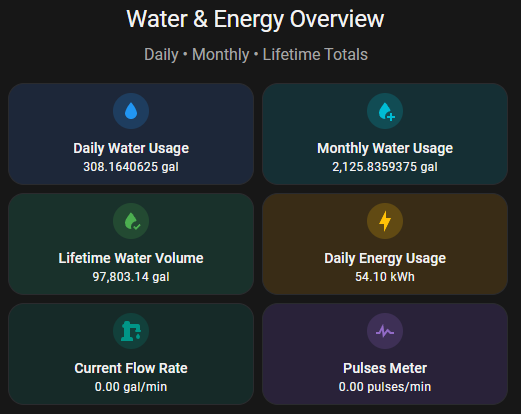
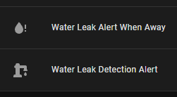

# ESP8266 G1" Water Flow Sensor for Home Assistant

<p align="center">
  
</p>

[](https://esphome.io)
[](LICENSE)
[](https://www.espressif.com)
[](https://www.home-assistant.io)
[](https://github.com/itsdukenguyen/esp8266-water-flow-sensor/stargazers)

**Fully local DIY inline water flow meter** using a brass Hall-effect sensor.  
Accurate real-time flow in gallons per minute with total, daily, and monthly tracking.

---

## ✨ Features

- Real-time flow rate (**GPM**)
- Cumulative total + automatic daily & monthly usage
- Leak detection (when away from home)
- High-flow warning notifications
- Daily usage summary at 9 PM
- Real-world 5-gallon bucket calibration
- Fully local, encrypted MQTT, OTA updates via ESPHome

---

## 🛠️ Hardware

See [`BOM.md`](BOM.md) for the complete bill of materials and current pricing (≈ $35–45).

**Main Components:**
- NodeMCU ESP8266
- G1" Brass Hall-effect flow sensor
- Optional: HiLetgo DHT22 temperature/humidity sensor

---

## 🚀 Quick Start (One-command possible)

1. Copy `water-flow-sensor.yaml` into ESPHome
2. Update your WiFi credentials in `secrets.yaml`
3. Flash to your NodeMCU
4. The device will auto-discover in Home Assistant

```bash
# Using ESPHome CLI (optional)
esphome run water-flow-sensor.yaml
```

---

## 📸 Screenshots




---

## 📖 Full Documentation

- `BOM.md` — Parts list + links
- `water-flow-sensor.yaml` — Fully commented ESPHome config
- `docs/calibration-log.md` — Real test data & calibration formula
- `docs/automations.md` — All Home Assistant automations

---

## 🧪 Calibration & Accuracy

- Tested multiple times with a 5-gallon bucket.
- Full results and the calibration formula are in `docs/calibration-log.md`.

---

## 📝 Changelog

- See CHANGELOG.md

---

## 🤝 Contributing

Contributions and ideas are welcome! See CONTRIBUTING.md

---

## 📄 License

MIT License © 2026 Duc Nguyen

---

Star this repo if it helped you monitor your water usage! 🌊

Last updated: May 2026