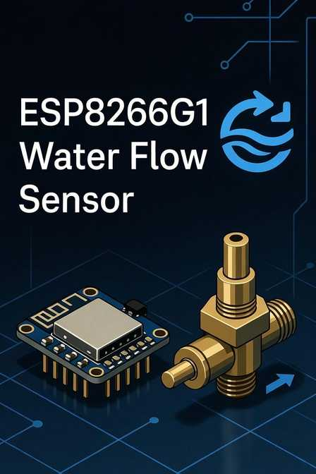

# ESP8266 G1" Water Flow Sensor for Home Assistant

<p align="center">
  
</p>

[](https://esphome.io)
[](LICENSE)
[](https://www.espressif.com)
[](https://www.home-assistant.io)

**Fully local DIY inline water flow meter** using a brass Hall-effect sensor. Accurate real-time flow in gallons per minute with total, daily, and monthly tracking.

## Features
- Real-time flow rate (**gal/min**)
- Cumulative + automatic daily/monthly usage
- Leak detection when away
- High flow warning
- Daily usage summary (9 PM)
- Real-world 5-gallon bucket calibration
- Fully local, encrypted API, OTA updates

## Hardware
See [`BOM.md`](BOM.md) for full bill of materials and pricing.

## Quick Start
1. Copy `water-flow-sensor.yaml` into ESPHome
2. Update WiFi secrets
3. Flash to NodeMCU ESP8266
4. Auto-discovers in Home Assistant

## Wiring Diagram

```mermaid
graph TD
    subgraph "Water Flow"
        PipeIn[Water Inlet] --> Sensor["G1\" Brass Flow Sensor"]
        Sensor --> PipeOut[Water Outlet]
    end

    subgraph "NodeMCU ESP8266"
        ESP[NodeMCU<br>ESP8266]
    end

    Sensor -->|"Red<br>VCC"| ESP
    Sensor -->|"Black<br>GND"| ESP
    Sensor -->|"Yellow/White<br>Signal"| ESP

    style Sensor fill:#4ade80,stroke:#166534,stroke-width:2px
    style ESP fill:#60a5fa,stroke:#1e40af,stroke-width:2px